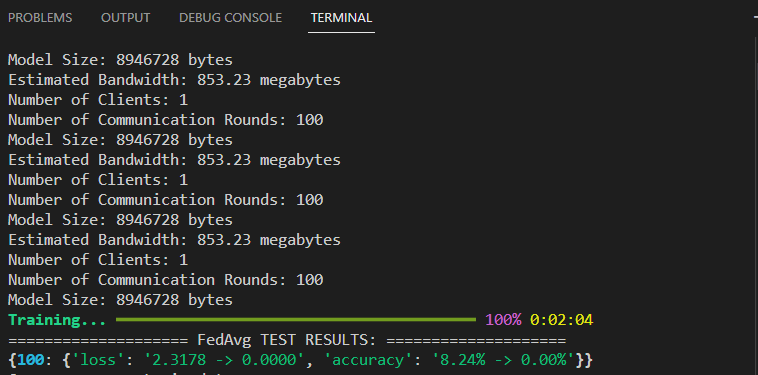

# CPS 595 - Software Engineering Project

# Project Title:  Bandwidth Estimation for Tiny Federated Learning

### Team Members
 - Rahul Theresaraj

### Mentors
 - Dr. Phu Phung
 - Dr. Ahmed El Ouadrhiri

 ### Company Sponsor and Mentors
 - UDRI
   - 

## Project code Reference:
```sh 
https://github.com/KarhouTam/FL-bench
```

## Project Management Information

Source code repository (private access): 
```sh
https://github.com/RahulTheresaraj/Tiny-Federated-Learning
```

### Revision History
| Date       |   Version     |  Description |
|------------|:-------------:|-------------:|
| DD/MM/YYYY |  0.0          | Init draft   |


## Overview
- In recent years, there is an emerging technology in the tech field known as Tiny Federated Learning, TFL for short. The TFL is derived from insertion of two machine learning fields which are TinyML and Federated Learning. TinyML  is deployment of machine learning models on resource-constrained devices, such as microcontrollers and low-powered embedded systems.  These have limited computational capabilities i.e, low processing power, memory and energy resources which makes it difficult to run models with large dataset and Federated learning is a machine learning approach that allows multiple devices or servers to train a model while preserving data on the local devices. The TFL  approach enables federated learning on small embedded devices with low computational resources. 


## Project Context and Scope
- Tiny Federated learning also known as TFL is an approach that deals with the intersection of two fields, each field has its challenges and together few of the challenges can be adapted. But it's still has few challenges that are yet to be resolved and those challenges in TFL are determining the Bandwidth communication or Bandwidth range and effective communication, As the federated learning model requires lot of computational resources as it deals with larger dataset and models, To use that in a embedded device is like going overboard and to send data or update to the server from an embedded device might result in loss of data while transmission, so it necessary to predict an estimated bandwidth to optimize communication efficiency.
- The Main motivation of this project is to determine the estimated bandwidth communication in Tiny federated learning and depending on the estimated bandwidth, the communication cost can be reduced to further evolve the bandwidth range.

## Federated Learning:
- A new approach called Federated Learning has been introduced, where only learning parameters of Deep Neural Network (DNN) are required to be communicated between the central server and the participants.

## Tiny Machine learning:
- Research in the fields of machine learning and embedded systems known as "TinyML" focuses on the kinds of models that may be used on compact, low-power hardware, such as microcontrollers. It provides edge devices with low-latency, low-power, and low-bandwidth model inference. The goal of this research is to develop a machine learning model that can be used in low-power, low-memory embedded devices, although it is extremely unlikely that this model can be implemented in such a device due to its high memory and compute requirements. We utilize the best model that can be used to operate it on a small edge device or an embedded device from the result of our study into the best machine learning model for embedded devices. The Scope of the project is to create a machine learning model that can be deployed and utilized to gather data from embedded devices like an Arduino or Bluefruit device. Also try this concept on various devices that gather data and deliver it to a single cloud server.


## Environment Setup:
- This project source code has been cloned from another author(https://github.com/KarhouTam/FL-bench), I am using this source code of Federated Averaging to estimate bandwidth communication..
 
open the terminal and run these commands

 Clone the repository into a local machine using:

 ```sh
 git clone https://github.com/RahulTheresaraj/Tiny-Federated-Learning.git
 ```
 
 Go to the folder
 ```sh
 cd Tiny-Federated-Learning
 ```
 
Install these dependencies before running the file:
```sh
pip install torch
pip install torch-vision
pip install visdom
pip install path
```

Install the dataset CIFAR10 dataset
```sh
cd data/utils
python run.py -d cifar10 -a 0.1 -cn 100
```
 The command above splits the CIFAR-10 dataset into into 100 subset for 100 clients according to the Dirichlet partitioning(0.1)

To run this progran from Tiny-Federated-Learning folder
```sh
- Server :
python src/server/fedavg.py

- To Monitor the federated learning:
Run 'python -m visdom.server' on terminal
Go check 'localhost:8097' on your browser

```
## Implementtaion:
 Here, The main objective was to build an estimation of Bandwidth,
 The mathematical formula to estimate bandwidth in Federated Averaging is  ``` W * C * R ```
 Where, 
 - W is the model update size
 - C is number of clients 
 - R is number of Communication Rounds, which is the number of times the model update is sent to the server.
 
Using the Source code, we find the model update is stored in tensors and we convert the tensors to bytes as we need model update in bytes,
- example, we have a tensor in format of size ```(100,100,32)``` and to convert that to bytes by taking product of the tensor size value ```100*100*32``` which is ```320000``` and this is in float32 format so we multiply that by ```4```, we get ```1280000 bytes``` as model update size.
- If we consider number of clients as ```100``` and number of epoch or communication rounds as ```100```. we get,
-- Bandwidth = ```1280000``` bytes * ```100``` clients * ```100``` Rounds = ```12800000000 bytes```.
- But Bandwidth is estimated in megabyte's. So, 
-- Bandwidth in MB = Bandwidth in bytes/(```1024 *1024```) = ```12207.03 MB```.

Here, In this project the client sends out model update in form of delta tensors, which is the newly updated parameters in the form of tensor after training to the server.
I have implemented Bandwidth estimator script that takes in the required values to estimate bandwidth for Federated Averaging. 
The bandwidth estimation is done by taking the delta update as model size and communication rounds as global epoch and number of clients is the given value when you download the dataset,```python run.py -d cifar10 -a 0.1 -cn 100```. The cn represents number of clients that has a value 100, so select number of clients you want to test before downloading your dataset.


Results: 
I tested out using number of clients has 1 and got the follwoing output:



## Software Process Management

### Scrum process

#### Sprint 0
Duration: 01/09/2023 - 01/20/2023
##### Completed Tasks
1. Project Plan.
2. Research on TinyML.
2. Research on ML Models.

#### Contributions:

#### Sprint Retrospection:

*****
*****

#### Sprint 1
Duration: 01/21/2023 - 02/15/2023
##### Tasks to be Completed
1. Research on how TinyML works.
2. Research on various implementation of TInyML

#### Contributions:
1. Rahul Theresaraj,


#### Sprint Retrospection:
*****
*****

#### Sprint 2
Duration: 02/16/2023 - 03/01/2023
##### Tasks to be Completed
1. Research on Federated learning
2. Research on Different Algorithms on Federated learning


#### Contributions:
1. Rahul Theresaraj,


#### Sprint Retrospection:
*****
*****

#### Sprint 3
Duration: 03/02/2023 - 03/28/2023
##### Tasks to be Completed
1. Research on optimizating communication in Federated learning


#### Contributions:
1. Rahul Theresaraj,


#### Sprint Retrospection:
*****
*****

#### Sprint 4
Duration: 03/29/2023 - 04/16/2023
##### Tasks to be Completed
1. Analyzing the source code.


#### Contributions:
1. Rahul Theresaraj,


#### Sprint Retrospection:
*****
*****

#### Sprint 5
Duration: 04/17/2023 - 04/30/2023
##### Tasks to be Completed
1. Analyzing the source to check dataset and communication.


#### Contributions:
1. Rahul Theresaraj,


#### Sprint Retrospection:
*****
*****

#### Sprint 6
Duration: 05/01/2023 - 05/17/2023
##### Tasks to be Completed
1. Working on the code to check communication of data from client and server.

#### Contributions:
1. Rahul Theresaraj,

#### Sprint Retrospection:
*****
*****

#### Sprint 7
Duration: 05/18/2023 - 05/31/2023
##### Tasks to be Completed
1. Researching on Bandwidth communication in Federated learning
2. 


#### Contributions:
1. Rahul Theresaraj,

#### Sprint Retrospection:
*****
*****

#### Sprint 8
Duration: 06/01/2023 - 06/11/2023
##### Tasks to be Completed
1. What are different research used using bandwidth in federated learning


#### Contributions:
1. Rahul Theresaraj,


#### Sprint Retrospection:
*****
*****

#### Sprint 9
Duration: 06/12/2023 - 06/25/2023
##### Tasks to be Completed
1. Building a Bandwidth estimator code.


#### Contributions:
1. Rahul Theresaraj,


#### Sprint Retrospection:
*****
*****

#### Sprint 10
Duration: 06/26/2023 - 07/02/2023
##### Tasks to be Completed
1. analyzing the bandwidth estimator to know how it works


#### Contributions:
1. Rahul Theresaraj,


#### Sprint Retrospection:
*****
*****
#### Sprint 11
Duration: 07/03/2023 - 07/25/2023
##### Tasks to be Completed
1. analysing the code what it takes in for model update.
2. Succesful implementaion of Bandwidth estimation.


#### Contributions:
1. Rahul Theresaraj,


#### Sprint Retrospection:
*****
*****