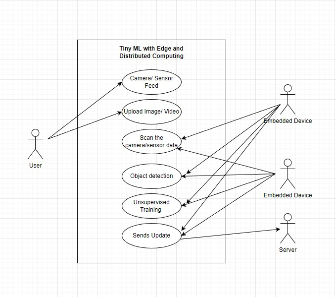
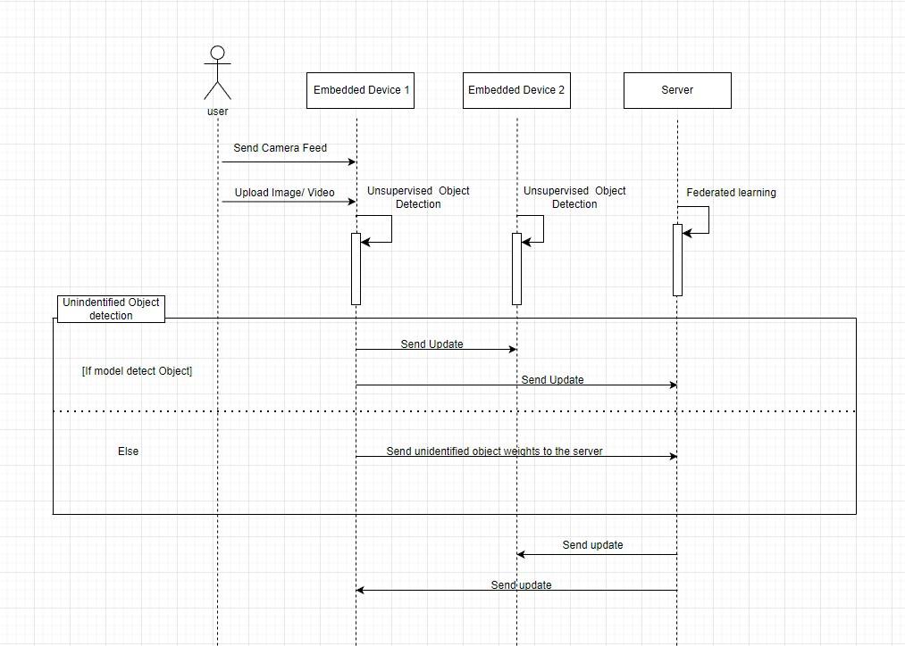

# CPS 595 - Software Engineering Project

# Project Title:  TinyML

### Team Members
 - Rahul Theresaraj

### Mentors
 - Dr. Phu Phung
 - Dr. Ahmed El Ouadrhiri

## Project Management Information

Management board (private access): https://trello.com/b/zuq18n1C/tinyml
Source code repository (private access): https://github.com/RahulTheresaraj/Tiny-Federated-Learning

### Revision History
| Date       |   Version     |  Description |
|------------|:-------------:|-------------:|
| DD/MM/YYYY |  0.0          | Init draft   |


## Overview
- These days, there are gadgets like AI cameras and AI electronics. These devices use machine learning to make sense of noisy sensor data, but this is difficult for embedded devices since they are small and have limited memory and processing capacity. TinyML is necessary because machine learning models need a lot of computing power. With TinyML, we can install and execute a neural network model on a tiny edge device which consumes less power. With that model, it will be tested on several edge devices that can utilize a this machine learning model that can communicate the results of trained data to the server while retaining the rest of the data in the edge device.

## Project Context and Scope
- Research in the fields of machine learning and embedded systems known as "TinyML" focuses on the kinds of models that may be used on compact, low-power hardware, such as microcontrollers. It provides edge devices with low-latency, low-power, and low-bandwidth model inference. The goal of this research is to develop a machine learning model that can be used in low-power, low-memory embedded devices, although it is extremely unlikely that this model can be implemented in such a device due to its high memory and compute requirements. We utilize the best model that can be used to operate it on a small edge device or an embedded device from the result of our study into the best machine learning model for embedded devices. The Scope of the project is to create a machine learning model that can be deployed and utilized to gather data from embedded devices like an Arduino or Bluefruit device. Also try this concept on various devices that gather data and deliver it to a single cloud server.

## System Analysis
### Use cases:
- The use case diagram shown in the figure below shows the communication between the embedded device framework and the end user, where each capability and communication will be recorded and carried out appropriately. The primary goal of this design diagram is to explain how each module communicates with the others.
- The user character in this case provides data, such as real-time camera/sensor data or a video/image.
- The embedded device examines the data supplied by the user before attempting object detection by training the data to look at things. The embedded device also does unsupervised training on the data to identify all the objects, then label the unidentified data and provides an update to the server.



### Sequence Diagram:
- The Below diagram depicts the Sequence Diagram which shows how users send data from cameras, sensors, or as images or videos to various embedded devices. The embedded device does unsupervised object detection, which tries analyze the data and identifies the objects and label them accordingly.
-The unlabeled data is then updated and labeled in that embedded device. The device then transmits the model's updated data to the server and other embedded devices.
- If it is unable to identify the object, it transmits to the server certain weights containing the information of the unlabeled object.
- The server features a federated learning model that can recognize or learn the data to recognize and label the objects. 
- The server is now attempting to examine the weights and assign a label to the data.
- Then, The Server sends the updated information in the form of weights to all the embedded devices and those devices updates the information.



## Implementation:
 open the terminal and run these commands

 Clone the repository into a local machine using:

 ```sh
 git clone https://github.com/RahulTheresaraj/Tiny-Federated-Learning.git
 ```
 
 Go to the folder
 ```sh
 cd Tiny-Federated-Learning
 ```
Install these dependencies before running the file:
```sh
pip install torch
pip install torch-vision
pip install visdom
pip install path

```

To run this progran from Tiny-Federated-Learning folder
```sh
- Server :
python src/server/fedavg.py

- To Monitor the federated learning:
Run 'python -m visdom.server' on terminal
Go check 'localhost:8097' on your browser

```


## Software Process Management

### Scrum process

#### Sprint 0
Duration: 01/09/2023 - 01/20/2023
##### Completed Tasks
1. Project Plan.
2. Research on TinyML.
2. Research on ML Models.

#### Contributions:

#### Sprint Retrospection:

*****
*****

#### Sprint 1
Duration: 01/21/2023 - 02/3/2023
##### Tasks to be Completed
1. Research on Object detection.
2. Research on Pre-trained models for Object detection.
3. Building a pre-trained object detection.
4. Understanding and Testing the Pre-trained model.

#### Contributions:
1. Rahul Theresaraj,


#### Sprint Retrospection:
*****
*****

#### Sprint 2
Duration: 02/4/2023 - 02/17/2023
##### Tasks to be Completed
1. Research on unsupervised object detection.
2. Research on Federated learning.


#### Contributions:
1. Rahul Theresaraj,


#### Sprint Retrospection:
*****
*****

#### Sprint 3
Duration: 02/18/2023 - 03/02/2023
##### Tasks to be Completed
1. Research on federated learning
2. Understanding and experimenting with flwr framework
3. Understanding and experimenting with tensorflow framwework


#### Contributions:
1. Rahul Theresaraj,


#### Sprint Retrospection:
*****
*****

#### Sprint 4
Duration: 03/04/2023 - 03/17/2023
##### Tasks to be Completed
1. Researching on pruning a model 
2. Researching on pruning on pre-built model
3. Researching on pruning on federated learning


#### Contributions:
1. Rahul Theresaraj,


#### Sprint Retrospection:
*****
*****

#### Sprint 5
Duration: 03/18/2023 - 03/31/2023
##### Tasks to be Completed
1. implementation on other federated learning frameworks
2. understanding and experimenting on model pruning.


#### Contributions:
1. Rahul Theresaraj,


#### Sprint Retrospection:
*****
*****

#### Sprint 6
Duration: 04/01/2023 - 04/14/2023
##### Tasks to be Completed
1. working on tiny federated learning

#### Contributions:
1. Rahul Theresaraj,

#### Sprint Retrospection:
*****
*****

#### Sprint 7
Duration: 04/15/2023 - 04/28/2023
##### Tasks to be Completed
1. Researching on Bandwidth communication in Federated learning
2. understanding bandwidth communication by analyzing the code.


#### Contributions:
1. Rahul Theresaraj,

#### Sprint Retrospection:
*****
*****